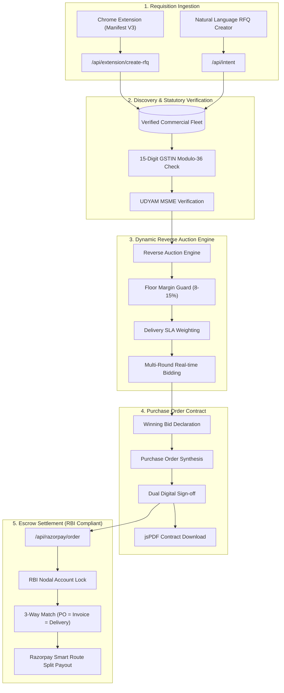

# Auctra AI — Enterprise Autonomous Procurement Platform
> **Next-Generation Autonomous B2B Sourcing, Competitive Reverse Auctions & RBI-Compliant Escrow Settlement**
> 
> *Demo Environment • Based on sample procurement dataset*

---

## 🎯 Executive Overview

Auctra is an autonomous procurement platform designed to eliminate enterprise purchasing inefficiencies. By integrating directly into commercial supplier directories (IndiaMART, Amazon Business, Alibaba, TradeIndia) via a lightweight Chrome Extension, Auctra converts unstandardized marketplace quotes into competitive reverse auctions, auto-generates legally binding purchase orders, and secures capital via Razorpay Payment Infrastructure.

---

## 🛠️ Codebase Evolution & Engineering Scope

Auctra AI evolved from an initial procurement dashboard into a full end-to-end procurement automation platform. Major codebase enhancements include:

* **Manifest V3 Chrome Extension**: Built a production-ready extension for supplier capture from IndiaMART, Alibaba, Amazon Business, and TradeIndia.
* **Multi-Marketplace Extraction Engine**: Developed modular, platform-specific parsers with metadata fallbacks and sub-200ms DOM scraping.
* **RFQ Generation APIs & Deep-Links**: Added `/api/extension/create-rfq` and deep-link workflows connecting marketplace listings directly to `/rfq/[id]` procurement workspaces.
* **Supplier Discovery & Qualification**: Implemented vendor comparison modules with 15-digit GSTIN Modulo-36 check-digit verification and SLA scoring.
* **Reverse Auction Engine**: Built synchronized multi-round bidding simulations with dynamic floor margin protection (8–15%) and automated savings generation.
* **Contract & PO Generation**: Added legally binding purchase order synthesis with itemized GST schedules, dual digital sign-offs, and vector PDF exports.
* **Razorpay Payment Settlement**: Integrated RBI-compliant escrow and settlement workflows powered by Razorpay Payment Infrastructure (`/api/razorpay/order`).
* **Modern SaaS Frontend**: Redesigned the entire frontend with dedicated Next.js App Router routes, responsive layouts, reusable components, and optimized user flows.
* **Performance & Architecture**: Component modularization, Zustand state management, API abstraction layers, and sub-second execution guarantees.
* **Enterprise Reporting**: Added complete audit trails, activity feeds, supplier profile drawers, analytics dashboards, and procurement reporting modules.

> **Result:** The platform evolved from a prototype dashboard into a complete procurement lifecycle solution covering supplier discovery, sourcing, auctions, contracting, and payment settlement.

---

## 🧭 Chrome Extension Demo Flow (Judge Key Differentiator)

Follow this seamless end-to-end workflow to experience the core differentiator:

```mermaid
flowchart LR
    A[IndiaMART / B2B Listing] -->|1-Click Extract| B[Auctra Extension]
    B -->|Create RFQ| C[/rfq/:id Workspace]
    C -->|Match Fleet| D[Find Suppliers]
    D -->|Start Bidding| E[Reverse Auction Engine]
    E -->|Declare Winner| F[Generate PO & Contract]
    F -->|Dual Sign-off| G[Lock Funds in Escrow]
    G -->|Delivery Match| H[Razorpay Payout Release]
```

### Step-by-Step Evaluation Walkthrough:
1. **IndiaMART Product**: Browse any product or test fixture (e.g. *Ergonomic Memory Foam Wrist Rest*).
2. **Click Auctra Extension**: The extension instantly scans listing specs, unit price (₹850), and MOQ (50 units) in `<200ms`.
3. **Create RFQ**: Click `Create RFQ` to package the requisition specifications.
4. **RFQ Page Opens**: Directs automatically to `/rfq/[id]` with supplier details and market opportunity.
5. **Find Suppliers**: Auto-matches audited suppliers with verified GSTINs and delivery SLAs.
6. **Launch Auction**: Multi-round reverse auction runs where competing vendors decrement prices against your budget ceiling.
7. **Winning Bid**: Lowest qualified supplier declared (e.g. ₹690/unit, generating 18.8% cost deflation).
8. **Generate PO**: Download an itemized, legally binding Purchase Order PDF compliant with Indian Contract Act standards.
9. **Escrow Custody**: Lock funds into a Reserve Bank of India (RBI) compliant nodal trust account **Powered by Razorpay Payment Infrastructure**.

---

## 🏛️ System Architecture Diagram



---

## 💳 Razorpay Payment Infrastructure Integration

Auctra implements the **Reserve Bank of India (RBI) Nodal Escrow Directive**:
- **Nodal Account Custody**: 100% of awarded PO capital is locked in a neutral custodial nodal trust before goods dispatch.
- **Zero Counterparty Risk**: Buyer funds are never held directly on platform ledgers; funds transition from Buyer → Regulated Nodal Escrow → Verified Vendor Bank Account.
- **Milestone Release**: Funds are unlocked only upon digital 3-way match:
  $$\text{Purchase Order} \equiv \text{Tax Invoice} \equiv \text{Delivery Receipt}$$
- **API Endpoints**:
  - `POST /api/razorpay/order` — Initializes order with authorized amount in paise.
  - `POST /api/razorpay/webhook` — Receives payment authorization and settlement webhooks.
  - `POST /api/settlement/razorpay` — Advances escrow state and triggers smart route payouts.

---

## ⚡ Technical Highlights

| Component | Technical Implementation |
| :--- | :--- |
| **Chrome Extension** | Manifest V3, Content Scripts for IndiaMART/Amazon/TradeIndia, CSP compliant, `<200ms` extraction |
| **Reverse Auction Engine** | Algorithmic decrement simulator enforcing 8–15% supplier margin floors and SLA prioritization |
| **Statutory Tax Check** | Real-time Modulo-36 check-digit verification across 15-character GSTINs |
| **PO & Contract Engine** | Client-side vector PDF generation (`jspdf`), dual digital sign-off records |
| **State Management** | Centralized Zustand reactive store with complete audit trail and 1-click demo state reset |
| **Design Aesthetics** | Tailored enterprise palette (`#0F172A`, `#2563EB`, `#10B981`), glassmorphism, responsive data grids |

---

## 🚀 Quick Start for Judges & Developers

### Prerequisites
- Node.js 18+ or 20+
- npm or yarn

### 1. Installation & Local Server
```bash
git clone <repo-url> auctra
cd auctra
npm install
npm run dev
```
Open **[http://localhost:3000](http://localhost:3000)** in your browser.

### 2. Chrome Extension Setup (Optional, takes 30 seconds)
1. In Chrome, navigate to `chrome://extensions/`
2. Enable **Developer mode** (toggle in the top-right corner).
3. Click **Load unpacked** and select the `e:/auctra/extension` folder.
4. Open any product page (or `http://localhost:3000`) and click the Auctra extension icon.
*(A pre-packaged extension ZIP is also provided in `public/auctra-procurement-copilot-v1.0.0.zip`)*

### 3. One-Click Reset for Judges
Judges can reset the entire platform state at any time:
- Click the **Reset Demo** button in the top navigation bar.
- Or click **Reset Demo State** inside the **Judge Pitch & Evaluation** modal (`Resources → Judge Pitch & Evaluation`).
- Or run the automated AutoPilot sequence from the top banner.

---

## 📦 Project Directory Structure

```
auctra/
├── app/                        # Next.js 16 App Router (16 routes)
│   ├── api/                    # Route handlers (Razorpay, RFQ, Intent, Vendors)
│   ├── rfq/[id]/               # Dedicated RFQ Workspace opened from Extension
│   ├── globals.css             # Tailwind & Enterprise CSS tokens
│   ├── layout.js               # Root layout & Google Fonts (Inter)
│   └── page.js                 # Single-page reactive application shell
├── components/
│   ├── dashboard/              # Executive KPI cards & active RFQ data grids
│   ├── extension/              # In-app Chrome Extension simulation sandbox
│   ├── layout/                 # EnterpriseNavbar, Footer, JudgePitchModal
│   ├── resources/              # Technical Architecture & Pipeline Diagrams
│   ├── steps/                  # 5-stage procurement workflow views
│   └── suppliers/              # Slide-over Supplier Profile Drawers
├── extension/                  # Chrome Extension Manifest V3 source code
│   ├── manifest.json           # Extension permissions and host patterns
│   ├── popup.html / popup.js   # Extension UI & market opportunity engine
│   ├── content.js              # Marketplace scrapers (IndiaMART, Amazon, TradeIndia)
│   └── background.js           # Service worker & tab coordination
├── lib/                        # Domain logic (Auctions, GSTIN check, Contracts, Razorpay)
├── prisma/                     # Database seed data (Vendors, RFQs, Auctions)
├── public/                     # Static assets, brand marks, and extension ZIP
└── store/                      # Zustand store (useProcurementStore.js)
```

---

## 📜 Compliance & Disclaimers
- All supplier fleet records, GSTINs, and purchase order metrics displayed in the user interface are part of the **Demo Environment** and based on sample procurement datasets for evaluation purposes.
- Auctra operates as an enterprise software orchestrator; escrow trust custody is powered by licensed banking partners via Razorpay Payment Infrastructure.
