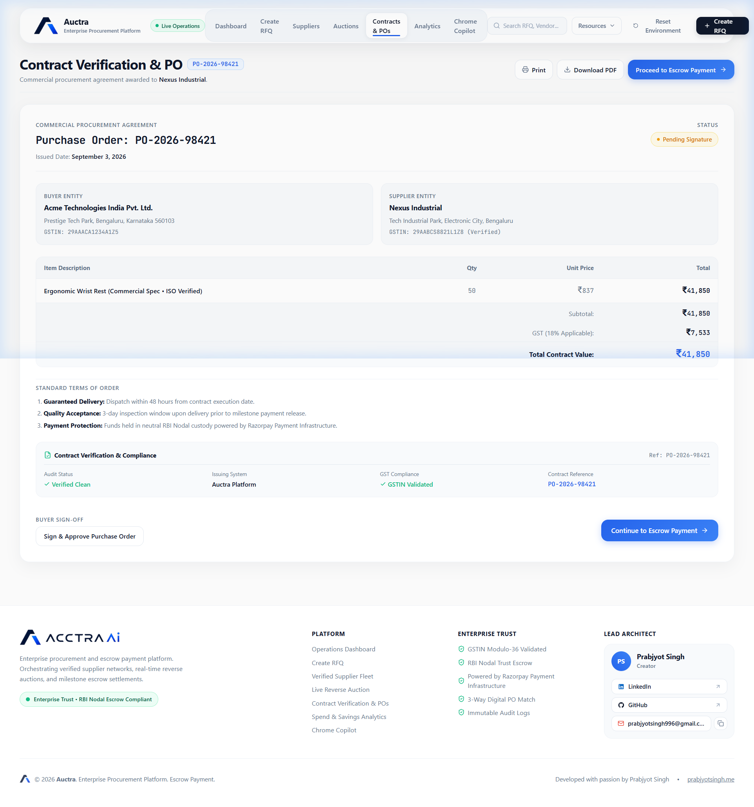
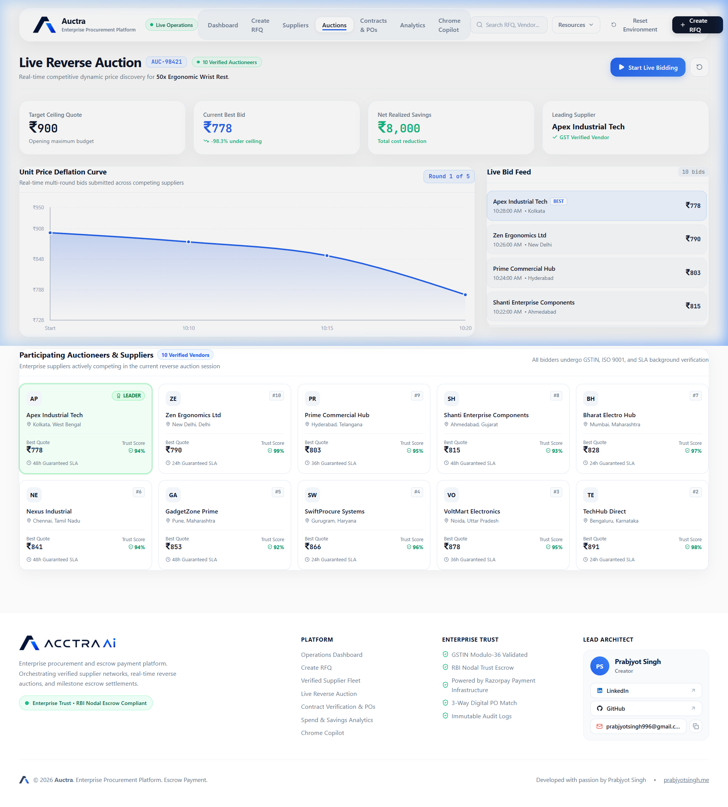
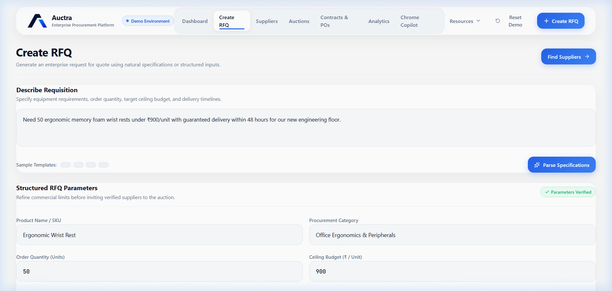
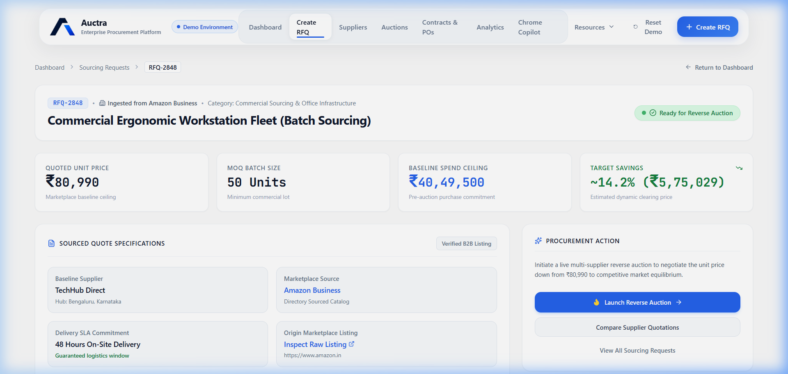
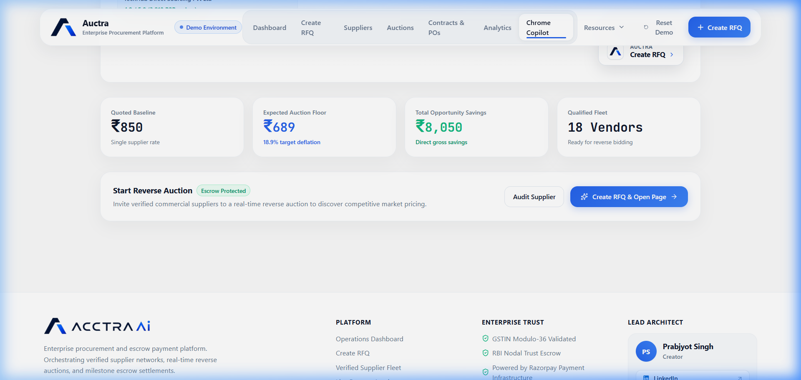
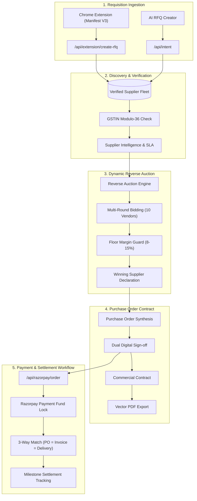

# Auctra AI

<div align="center">

# AI-Powered Autonomous Procurement & Supplier Management Platform

Transform supplier discovery into competitive sourcing, automate reverse auctions, and streamline purchasing decisions through a unified procurement platform.


</div>

---

## ⚡ The 30-Second Demo Story

### The Problem
Traditional enterprise procurement teams waste days on manual, fragmented workflows:
- ❌ **Finding suppliers** across disjointed directories and marketplaces
- ❌ **Comparing quotations** with unstandardized specs and ambiguous delivery SLAs
- ❌ **Negotiating pricing** via endless emails without competitive transparency
- ❌ **Creating purchase orders** through slow manual contract drafting
- ❌ **Managing settlements** with high counterparty risk and delayed payouts

### The Solution: Auctra AI
Auctra AI automates the entire procurement lifecycle end-to-end:

$$\text{Supplier Discovery} \longrightarrow \text{Reverse Auction} \longrightarrow \text{Contract Generation} \longrightarrow \text{Settlement Workflow}$$

1. **Supplier Discovery**: 1-click Chrome Extension extracts listings from IndiaMART, Alibaba, and Amazon Business into standardized RFQs with instant 15-digit GSTIN Modulo-36 verification.
2. **Reverse Auction**: Algorithmic multi-round dynamic bidding drives down unit costs against budget ceilings while protecting vendor floor margins.
3. **Contract Generation**: Legally binding Purchase Orders generated in `<1s` with dual digital signatures and PDF downloads.
4. **Settlement Workflow**: Milestone-based payment custody and settlement tracking powered by Razorpay Payment Infrastructure.

---

## 📸 Product Walkthrough & Screenshots

### 1. Executive Procurement Dashboard
Real-time visibility into annual spend, cost savings, active RFQs, and vendor SLA benchmarks.


### 2. Live Reverse Auction Engine
Real-time unit price deflation curve with multi-round bids from 10 verified enterprise auctioneers.


### 3. Verified Supplier Fleet & RFQs
Audited suppliers with GSTIN check-digit verification, SLA scores, and itemized quotations.


### 4. Digital Purchase Orders & Contracts
Legally binding commercial contracts with itemized GST tax breakdowns and dual digital sign-offs.


### 5. Chrome Extension Copilot
1-click marketplace sourcing from IndiaMART, Amazon Business, and Alibaba directly into Auctra.


---

# Key Features

## Procurement Management
Create and manage sourcing requests through a structured procurement workflow.
- RFQ Creation
- Budget Management
- Quantity Management
- Category-Based Procurement
- Procurement Lifecycle Tracking

---

## Supplier Discovery
Discover and evaluate suppliers from multiple sourcing channels.
- Supplier Database
- 15-digit GSTIN Modulo-36 Verification
- Supplier Comparison & Trust Scoring
- Supplier Profiles
- SLA & Fulfillment Insights

---

## Reverse Auctions
Drive supplier competition and improve procurement outcomes.
- Real-time Multi-Round Bidding Environment
- Dynamic Unit Price Deflation Curve
- 10 Active Verified Enterprise Auctioneers
- Floor Margin Guard Protection (8–15%)
- Automated Savings Calculation

---

## Contract Management
Generate procurement documentation and maintain audit-ready records.
- Purchase Order Generation
- Legally Binding Commercial Contracts
- Dual Digital Sign-off Verification
- Procurement Audit Trails
- Instant Vector PDF Export

---

## Payment & Settlement
Manage procurement transactions and payment workflows.
- Powered by Razorpay Payment Infrastructure
- Milestone-Based Escrow Fund Locking
- Digital 3-Way Match Verification (PO = Invoice = Delivery Receipt)
- Settlement Monitoring & Audit Logs

---

## Spend Analytics
Gain visibility into procurement performance.
- Spend Analysis & Annual Commitments
- Realized Cost Reduction
- Procurement Reporting
- Supplier Performance Metrics
- Cycle Time Analytics

---

## Browser Extension (Manifest V3)
Capture supplier information directly from supplier marketplaces and instantly create procurement requests.

### Supported Platforms
- IndiaMART
- Amazon Business
- Alibaba
- TradeIndia

### Features
- One-Click RFQ Creation (<200ms extraction)
- Product Information Extraction
- Supplier Information Capture
- Marketplace Integration
- Direct Routing to Dedicated `/rfq/[id]` Workspace

---

# System Architecture



---

# Procurement Workflow

```text
Supplier Marketplace (IndiaMART / Alibaba / Amazon)
        │
        ▼
Chrome Extension (1-Click Extract)
        │
        ▼
Create RFQ (/rfq/[id] Workspace)
        │
        ▼
Supplier Discovery & GSTIN Audit
        │
        ▼
Live Reverse Auction (10 Competing Suppliers)
        │
        ▼
Winning Supplier Selection
        │
        ▼
Purchase Order & Contract Generation
        │
        ▼
Payment & Settlement via Razorpay
```

---

# Technology Stack

## Frontend
- Next.js 16 (App Router)
- React 19
- JavaScript (ES6+)
- Tailwind CSS v4

## Backend & APIs
- Next.js Server Route Handlers
- REST APIs (`/api/extension/create-rfq`, `/api/razorpay/order`, `/api/intent`)

## Database & ORM
- PostgreSQL
- Supabase
- Prisma ORM

## Browser Extension
- Chrome Extension Manifest V3
- Service Workers & Background Scripts
- Content Scripts for IndiaMART, Amazon, TradeIndia, Alibaba
- Chrome Storage API

## Payments
- Razorpay Payment Infrastructure Integration
- Standard Checkout Modal
- Webhook Handlers (`/api/razorpay/webhook`)

## State Management
- Zustand Reactive Store (`store/useProcurementStore.js`)

---

# Project Structure

```bash
auctra/
├── app/                        # Next.js 16 App Router
│   ├── api/                    # Route handlers (Razorpay, RFQ, Intent, Vendors)
│   ├── rfq/[id]/               # Dedicated RFQ Workspace opened from Extension
│   ├── documentation/          # Developer & REST API Documentation
│   ├── resources/              # Enterprise Knowledge Hub
│   ├── architecture/           # Interactive Technical Blueprint
│   ├── security/               # Enterprise Trust & Compliance Center
│   ├── support/                # Client Support Desk & SLA Ticketing
│   ├── evaluation/             # Evaluation & Verification Playbook
│   ├── globals.css             # Tailwind & Enterprise CSS tokens
│   ├── layout.js               # Root layout & Google Fonts
│   └── page.js                 # Single-page reactive application shell
├── components/
│   ├── dashboard/              # Executive KPI cards & active RFQ data grids
│   ├── documentation/          # Documentation view & API specifications
│   ├── evaluation/             # EvaluationView & EvaluationModal
│   ├── extension/              # In-app Chrome Extension simulation sandbox
│   ├── layout/                 # EnterpriseNavbar, Footer, Topbar
│   ├── resources/              # ArchitectureView & ResourcesView
│   ├── security/               # SecurityView compliance center
│   ├── support/                # SupportView helpdesk & SLA ticketing
│   ├── steps/                  # 5-stage procurement workflow views
│   └── suppliers/              # Slide-over Supplier Profile Drawers
├── docs/
│   └── screenshots/            # High-resolution documentation screenshots
├── extension/                  # Chrome Extension Manifest V3 source code
│   ├── manifest.json           # Extension permissions and host patterns
│   ├── popup.html / popup.js   # Extension UI & market opportunity engine
│   ├── content.js              # Marketplace scrapers (IndiaMART, Amazon, TradeIndia)
│   └── background.js           # Service worker & tab coordination
├── lib/                        # Domain logic (Auctions, GSTIN check, Contracts, Razorpay)
├── prisma/                     # Database schema & seed data
├── public/                     # Static assets, brand marks, and extension ZIP
└── store/                      # Zustand store (useProcurementStore.js)
```

---

# Getting Started

## Clone Repository

```bash
git clone https://github.com/prabjyotsingh/razorpay-auctraai.git
cd razorpay-auctraai
```

## Install Dependencies

```bash
npm install
```

## Configure Environment Variables

Create a `.env.local` file:

```env
NEXT_PUBLIC_APP_URL=http://localhost:3000

RAZORPAY_KEY_ID=your_key_id
RAZORPAY_KEY_SECRET=your_key_secret

GROQ_API_KEY=your_groq_api_key

DATABASE_URL=your_database_url
SUPABASE_URL=your_supabase_url
SUPABASE_ANON_KEY=your_supabase_anon_key
```

## Run Development Server

```bash
npm run dev
```

Open [http://localhost:3000](http://localhost:3000) in your browser.

---

# Browser Extension Setup

## Load Extension in Chrome

1. Open Chrome
2. Navigate to `chrome://extensions`
3. Enable **Developer Mode** (toggle in the top-right corner)
4. Click **Load Unpacked**
5. Select the `extension` folder
6. Pin the extension to the toolbar

The extension is now available on supported supplier marketplaces.

---

# Example Use Case

### Scenario
A procurement manager discovers a supplier listing on IndiaMART.

### Workflow
1. Open supplier listing on IndiaMART or Alibaba
2. Launch Auctra AI Extension
3. Capture supplier information and click **Create RFQ**
4. Dedicated RFQ workspace opens automatically (`/rfq/[id]`)
5. Discover alternative verified suppliers
6. Launch reverse auction with 10 competing bidders
7. Select winning supplier and generate Purchase Order
8. Complete payment workflow powered by Razorpay

---

# Security & Compliance

Auctra AI follows secure application practices:
- Secure API Communication & CORS protection
- Strict Environment Variable Management (.env* ignored)
- 15-Digit GSTIN Modulo-36 Check-Digit Verification
- Audit Logging & Transaction Monitoring
- Razorpay Payment Infrastructure Integration

---

# License

This project is intended for educational, research, and demonstration purposes.

---

# About Auctra AI

**Auctra AI** is a modern procurement platform focused on supplier discovery, competitive sourcing, procurement automation, and payment orchestration.

### Mission
Enable organizations to make faster, more informed purchasing decisions through streamlined procurement workflows and supplier intelligence.

---

© 2026 Auctra AI. All rights reserved.
