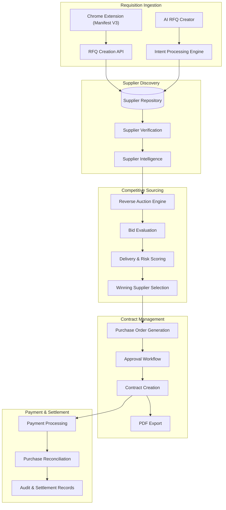

# Auctra AI

<div align="center">

# AI-Powered Procurement & Supplier Management Platform

Transform supplier discovery into competitive sourcing, automate procurement workflows, and streamline purchasing decisions through a unified procurement platform.


</div>

---

# Overview

Procurement teams often spend days collecting quotations, evaluating suppliers, negotiating prices, generating purchase orders, and coordinating payments across multiple systems.

**Auctra AI** centralizes this workflow into a single platform that enables organizations to:

- Create procurement requests (RFQs)
- Discover and evaluate suppliers
- Run competitive reverse auctions
- Generate purchase orders and contracts
- Manage payment workflows
- Track procurement performance through analytics

The result is a faster, more transparent, and more efficient procurement process.

---

# Key Features

## Procurement Management

Create and manage sourcing requests through a structured procurement workflow.

### Capabilities

- RFQ Creation
- Budget Management
- Quantity Management
- Category-Based Procurement
- Procurement Lifecycle Tracking

---

## Supplier Discovery

Discover and evaluate suppliers from multiple sourcing channels.

### Capabilities

- Supplier Database
- Vendor Qualification
- Supplier Comparison
- Supplier Profiles
- Supplier Performance Insights

---

## Reverse Auctions

Drive supplier competition and improve procurement outcomes.

### Capabilities

- Live Bidding Environment
- Bid Comparison
- Supplier Ranking
- Savings Tracking
- Supplier Competition Analysis

---

## Contract Management

Generate procurement documentation and maintain audit-ready records.

### Capabilities

- Purchase Order Generation
- Contract Creation
- Approval Workflows
- Procurement Audit Trails
- PDF Export

---

## Payment & Settlement

Manage procurement transactions and payment workflows.

### Capabilities

- Payment Tracking
- Settlement Monitoring
- Purchase Reconciliation
- Transaction History

---

## Spend Analytics

Gain visibility into procurement performance.

### Capabilities

- Spend Analysis
- Savings Tracking
- Procurement Reporting
- Supplier Performance Metrics
- Procurement Activity Monitoring

---

## Browser Extension

Capture supplier information directly from supplier marketplaces and instantly create procurement requests.

### Supported Platforms

- IndiaMART
- Amazon Business
- Alibaba
- TradeIndia

### Features

- One-Click RFQ Creation
- Product Information Extraction
- Supplier Information Capture
- Marketplace Integration
- Procurement Workflow Synchronization

---

# System Architecture

Auctra AI is designed as a modular procurement platform that orchestrates supplier discovery, competitive bidding, contract management, and payment settlement through a unified workflow.



---

# Procurement Workflow

```text
Supplier Marketplace
        │
        ▼
Chrome Extension
        │
        ▼
Create RFQ
        │
        ▼
Supplier Discovery
        │
        ▼
Reverse Auction
        │
        ▼
Supplier Selection
        │
        ▼
Purchase Order
        │
        ▼
Contract Generation
        │
        ▼
Payment & Settlement
```

---

# Technology Stack

## Frontend

- Next.js
- React
- JavaScript
- Tailwind CSS

## Backend

- Next.js API Routes
- REST APIs

## Database

- PostgreSQL
- Supabase

## Browser Extension

- Chrome Extension Manifest V3
- Service Workers
- Content Scripts
- Chrome Storage API

## Payments

- Razorpay Integration

## State Management

- Zustand

---

# Project Structure

```bash
auctra-ai/
│
├── app/
│   ├── api/
│   ├── dashboard/
│   ├── rfq/
│   └── layout/
│
├── components/
│   ├── procurement/
│   ├── suppliers/
│   ├── auctions/
│   ├── contracts/
│   ├── analytics/
│   └── ui/
│
├── extension/
│   ├── manifest.json
│   ├── background.js
│   ├── content.js
│   ├── popup.html
│   ├── popup.js
│   └── styles.css
│
├── lib/
├── store/
├── public/
├── hooks/
└── prisma/
```

---

# Getting Started

## Clone Repository

```bash
git clone https://github.com/prabjyotsingh/razorpay-auctraai.git

cd razorpay-auctraai
```

## Install Dependencies

```bash
npm install
```

## Configure Environment Variables

Create a `.env.local` file:

```env
NEXT_PUBLIC_APP_URL=http://localhost:3000

RAZORPAY_KEY_ID=your_key_id
RAZORPAY_KEY_SECRET=your_key_secret

GROQ_API_KEY=your_groq_api_key

DATABASE_URL=your_database_url
SUPABASE_URL=your_supabase_url
SUPABASE_ANON_KEY=your_supabase_anon_key
```

## Run Development Server

```bash
npm run dev
```

Open:

```text
http://localhost:3000
```

---

# Browser Extension Setup

## Load Extension in Chrome

1. Open Chrome
2. Navigate to:

```text
chrome://extensions
```

3. Enable **Developer Mode**
4. Click **Load Unpacked**
5. Select the `/extension` folder
6. Pin the extension to the toolbar

The extension is now available on supported supplier marketplaces.

---

# Example Use Case

### Scenario

A procurement manager discovers a supplier listing on IndiaMART.

### Workflow

1. Open supplier listing
2. Launch Auctra AI Extension
3. Capture supplier information
4. Create RFQ
5. Discover alternative suppliers
6. Launch reverse auction
7. Select supplier
8. Generate purchase order
9. Complete settlement workflow

---

# Analytics Dashboard

Track procurement performance through:

- Total Spend
- Procurement Savings
- Active RFQs
- Supplier Performance
- Contract Status
- Procurement Activity
- Procurement Cycle Time

---

# Security

Auctra AI follows secure application practices:

- Secure API Communication
- Environment Variable Management
- Authentication Controls
- Audit Logging
- Transaction Monitoring
- Access Control Mechanisms

---

# Roadmap

Future platform enhancements include:

- Multi-User Collaboration
- Advanced Approval Workflows
- ERP Integrations
- Supplier Scorecards
- AI Procurement Recommendations
- Predictive Spend Analytics
- Mobile Applications
- Advanced Reporting

---

# Use Cases

### Procurement Teams

- Reduce sourcing cycle time
- Improve supplier competition
- Centralize procurement operations

### Operations Teams

- Standardize purchasing workflows
- Improve procurement visibility
- Monitor supplier activity

### Growing Businesses

- Expand supplier networks
- Optimize purchasing decisions
- Improve spend control

---

# License

This project is intended for educational, research, and demonstration purposes.

---

# About Auctra AI

**Auctra AI** is a modern procurement platform focused on supplier discovery, competitive sourcing, procurement automation, and payment orchestration.

### Mission

Enable organizations to make faster, more informed purchasing decisions through streamlined procurement workflows and supplier intelligence.

---

© 2026 Auctra AI. All rights reserved.
